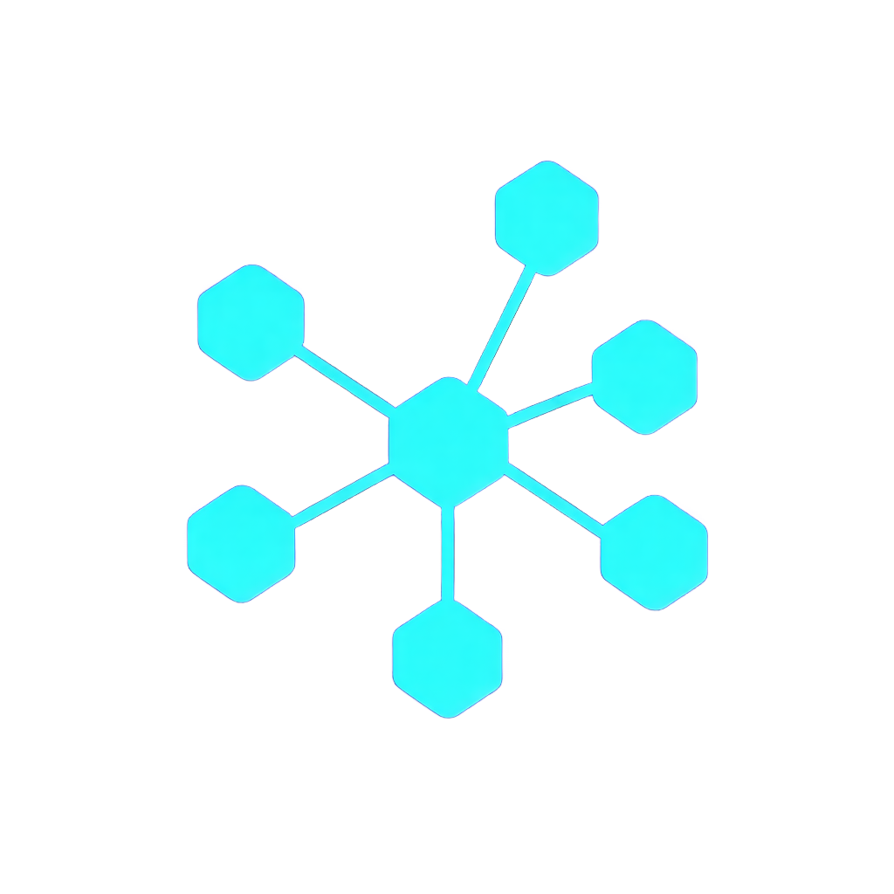

<p align="center">
  
</p>

<h1 align="center">OVERWATCH</h1>

<p align="center">
  Orchestrate parallel AI agents from a single pane of glass.
</p>

<p align="center">
  <a href="https://github.com/michaellandi/overwatch/actions/workflows/ci.yml"></a>
  <a href="https://github.com/michaellandi/overwatch/releases/latest"></a>
  <a href="https://github.com/michaellandi/overwatch/blob/mainline/LICENSE"></a>
</p>

---

Run multiple coding agents (Kiro, Claude, or any CLI tool) side-by-side with a persistent supervisor that monitors progress, detects when sessions are blocked, and lets you intervene without context-switching.

## Features

- **Multi-session management** — Run Kiro, Claude, or plain terminals in parallel tabs
- **Overwatch Agent** — AI orchestrator (Bedrock Claude) that delegates work to sessions, monitors progress, and answers questions
- **Stuck/Blocked detection** — Detects idle timeouts, repeated errors, output loops, and agent prompts waiting for input
- **Thinking indicator** — Pulsing dot shows when an agent is actively processing
- **Session resume** — Agents resume where they left off across app restarts (`--resume` for Kiro, `--continue` for Claude)
- **MCP Server** — External agents can manage sessions via MCP on `localhost:3777`
- **MCP Client** — Overwatch agent connects to your configured MCP servers for additional tools
- **Sound notifications** — Audible ding when a session gets blocked (configurable)
- **Themes** — 5 built-in themes (Obsidian default), persisted across restarts
- **Open With** — Quick-launch VS Code, Terminal, iTerm2, Finder, or Obsidian from any session
- **Persistent state** — Sessions, scrollback, panel sizes, and collapse states survive restarts

## Quick Start

```bash
npm install
npm start
```

`npm start` builds and launches the production Electron app.

For development with hot-reload on the renderer:

```bash
npm run dev
```

## Usage

### Creating Sessions

Click **+** in the sidebar or ask the Overwatch agent to create one. Choose:
- **Kiro** — Starts `kiro-cli chat` in the specified directory
- **Claude** — Starts `claude` CLI
- **Terminal** — Plain shell

Optionally provide an initial prompt that gets sent to the agent after it starts.

### Overwatch Agent

The bottom pane is your AI orchestrator. It can:
- Create, kill, and monitor sessions
- Peek at session output
- Send commands to sessions
- Read files, search, and list directories
- Use any tools from connected MCP servers

The agent coordinates — it delegates coding tasks to sessions rather than doing them itself.

### Blocked Detection

Sessions transition to **blocked** (◉) when:
- No output for the configured timeout (default 5 minutes)
- Repeated build failures, errors, or permission issues
- Agent is waiting for user input (approval prompts, y/n, etc.)
- Output is looping (same lines repeating)

A sound notification plays (configurable in Settings).

### Session States

| Icon | State | Meaning |
|------|-------|---------|
| ● | Working | Active, producing output |
| ⬤ (pulse) | Thinking | Agent is processing |
| ◉ | Blocked | Needs attention |
| ✓ | Done | Terminated |

## Settings

Access via ⚙ in the title bar:

- **General** — Theme, context folder, inactivity timeout, sound toggle
- **Agents** — Enable/disable agent options
- **Open With** — Enable/disable integrations
- **MCP** — View/add/remove connected MCP servers, view Overwatch server endpoint

## Configuration

Settings are stored in:
```
~/Library/Application Support/overwatch/settings.json
```

Other persisted data:
- `state.json` — Sessions and tabs
- `window-bounds.json` — Window size/position  
- `scrollback/` — Terminal history per tab

### MCP Servers

Configure MCP servers that the Overwatch agent connects to for tools. Add them in Settings → MCP or edit `settings.json` directly:

```json
{
  "mcpServers": [
    { "name": "my-tools", "command": "my-mcp-server", "args": [] },
    { "name": "another-server", "command": "npx", "args": ["-y", "some-mcp-server"] }
  ]
}
```

### Context Folder

Place an `AGENTS.md` file in your context folder (default `~/Desktop/brain`) to customize the Overwatch agent's behavior with additional instructions.

## Architecture

```
src/
├── shared/types.ts              — Session, Tab, Event types
├── main/
│   ├── index.ts                 — Electron entry, IPC handlers, settings
│   ├── orchestrator.ts          — Session registry, PTY management, stuck detection
│   ├── strands-agent.ts         — Bedrock ConverseStream tool-calling loop
│   ├── stuck-detector.ts        — RingBuffer + pattern matching
│   └── mcp-server.ts           — Streamable HTTP MCP server on :3777
├── preload/index.ts             — contextBridge API
└── renderer/src/
    ├── App.tsx                  — Root layout, session state management
    ├── ThemeProvider.tsx        — Theme context
    └── components/
        ├── Sidebar.tsx          — Session list, create modal
        ├── SessionView.tsx      — Tab bar, terminal host, landing page
        ├── TerminalView.tsx     — xterm.js integration
        ├── OverwatchPane.tsx    — Chat UI, streaming, tool bubbles
        └── Settings.tsx         — 4-tab settings modal
```

**Stack:** Electron · React · TypeScript · xterm.js · node-pty · Bedrock · MCP

## Scripts

```bash
npm start          # Build + run production
npm run dev        # Development with hot reload
npm run build      # Production build only
npm test           # Run tests (vitest)
npm run typecheck  # TypeScript checking
```

## Packaging

To distribute as a standalone app:

```bash
npm install --save-dev electron-builder
npm run dist       # Produces .dmg / .zip in dist/
```

## License

MIT — see [LICENSE](LICENSE).
